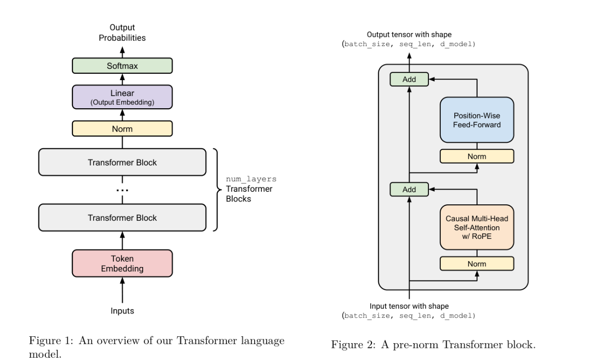
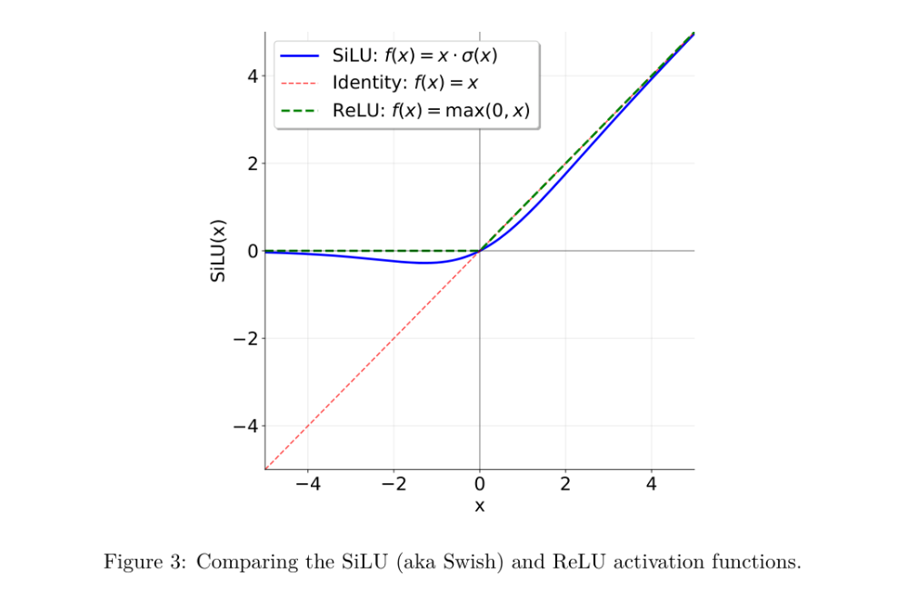

# 第三章：Transformer 语言模型架构

语言模型以一个批量化的整数 token ID 序列作为输入（即形状为 `(batch_size, sequence_length)` 的 `torch.Tensor`），并返回对词表的（批量化）归一化概率分布（即形状为 `(batch_size, sequence_length, vocab_size)` 的 PyTorch Tensor）。其中，对序列中每个输入 token，模型都会给出“下一个词”的预测分布。训练语言模型时，我们用这些 next-token 预测来计算真实下一个词与预测分布之间的交叉熵损失。推理生成文本时，我们取最后一个时间步（即序列最后一个位置）的 next-token 预测分布来生成下一个 token（例如取最大概率 token、从分布中采样等），把新生成的 token 追加到输入序列后重复这一过程。

在本作业的这一部分，你将从零开始构建 Transformer 语言模型。我们先给出模型的高层描述，然后逐步细化各个组件。


图 1：Transformer 语言模型的整体结构概览。
图 2：一个 pre-norm Transformer block。

## 3.1 Transformer LM

给定一个 token ID 序列，Transformer 语言模型会使用输入 embedding 把 token ID 转换为稠密向量；随后把这些 embedding 后的 token 依次输入 `num_layers` 个 Transformer block；最后再用一个可学习的线性投影（也常称为 output embedding 或 LM head）产生预测的 next-token logits。示意图见图 1。

### 3.1.1 Token Embeddings

Transformer 的第一步是把（批量化的）token ID 序列嵌入（embed）为一串向量，以表示 token 的身份信息（图 1 中红色方块）。

更具体地说：给定 token ID 序列，Transformer LM 使用 token embedding 层输出一串向量。Embedding 层输入为形状 `(batch_size, sequence_length)` 的整数张量，输出为形状 `(batch_size, sequence_length, d_model)` 的向量序列。

### 3.1.2 Pre-norm Transformer Block

Embedding 之后，激活会被多个结构相同的神经网络层处理。标准的 decoder-only Transformer LM 由 `num_layers` 个相同的层组成（通常称为 Transformer “blocks”）。每个 Transformer block 接收形状 `(batch_size, sequence_length, d_model)` 的输入，并返回相同形状的输出。每个 block 都会在序列维度上聚合信息（通过 self-attention），并进行非线性变换（通过前馈网络）。

## 3.2 输出归一化与输出投影

经过 `num_layers` 个 Transformer block 之后，我们会把最终激活变换为对词表的分布。

我们将实现 “pre-norm” Transformer block（详见 § 3.5）。这种结构还要求在最后一个 Transformer block 之后再做一次层归一化（见下文），以确保输出的尺度合适。

完成归一化后，我们使用一个标准的可学习线性变换把 Transformer block 的输出转为 next-token logits（例如 Radford et al. \[2018] 的公式 2）。

## 3.3 说明：Batching、Einsum 与高效计算

在 Transformer 中，我们会对许多“类似 batch 的输入维度”重复执行相同计算。比如：

- **batch 维度**：对 batch 中每个样本都执行相同的 Transformer 前向计算。
- **序列长度维度**：诸如 RMSNorm、前馈网络这类 “position-wise” 操作，会对序列中每个位置独立且一致地执行。
- **注意力头维度**：注意力操作会在多个 attention head 上进行 batching，形成 “multi-headed” attention。

我们希望用一种既能充分利用 GPU、又易读易写的方式来表达这类操作。许多 PyTorch 运算都支持在张量最前面带有额外的“batch-like”维度，并会高效地在这些维度上重复/广播运算。

例如，考虑一个 position-wise 的批量运算：有一个数据张量 `D`，形状为 `(batch_size, sequence_length, d_model)`；我们希望对每个位置做向量-矩阵乘法，矩阵 `A` 形状为 `(d_model, d_model)`。此时直接写 `D @ A` 就是 batched matrix multiply：其中 `(batch_size, sequence_length)` 会作为 batch 维度被一起计算。

因此，写代码时最好假设函数可能收到额外的 batch-like 维度，并把这些维度保留在张量 shape 的最前面。为了让张量能这样 batching，常常需要频繁用 `view` / `reshape` / `transpose` 来调整形状，这既麻烦也不直观。

更符合人体工学的选择是使用 `torch.einsum` 的 einsum 记号，或使用与框架无关的库如 `einops` / `einx`。其中两个关键操作是：

- `einsum`：对输入张量执行任意维度的张量收缩（tensor contraction）。
- `rearrange`：对张量维度进行重排、拼接、拆分等。

在机器学习中，几乎所有运算都可以看成“维度整理 + 张量收缩 +（偶尔的、通常是逐点的）非线性函数”。因此，使用 einsum 记号往往能让代码更可读、更灵活。

我们强烈建议在本课程中学习并使用 einsum 记号：没接触过 einsum 的同学可以从 `einops` 开始（文档见这里），已经熟悉 `einops` 的同学可以进一步学习更通用的 `einx`（见这里）。<sup>4</sup> 两个包在我们提供的环境中都已安装。

下面给出一些 einsum 的用法示例，作为 `einops` 文档的补充（建议先读 `einops` 文档）。

**示例（einstein\_example1）：用** **`einops.einsum`** **做 batched matrix multiplication**

```python
import torch
from einops import rearrange, einsum

## Basic implementation
Y = D @ A.T
# Hard to tell the input and output shapes and what they mean.
# What shapes can D and A have, and do any of these have unexpected behavior?

## Einsum is self-documenting and robust
# D A -> Y
Y = einsum(D, A, "batch sequence d_in, d_out d_in -> batch sequence d_out")

## Or, a batched version where D can have any leading dimensions but A is constrained.
Y = einsum(D, A, "... d_in, d_out d_in -> ... d_out")
```

**示例（einstein\_example2）：用** **`einops.rearrange`** **表达广播运算**

我们有一批图像，希望对每张图像生成 10 个不同“变暗程度”的版本：

```python
images = torch.randn(64, 128, 128, 3)  # (batch, height, width, channel)
dim_by = torch.linspace(start=0.0, end=1.0, steps=10)

## Reshape and multiply
dim_value = rearrange(dim_by, "dim_value -> 1 dim_value 1 1 1")
images_rearr = rearrange(images, "b height width channel -> b 1 height width channel")
dimmed_images = images_rearr * dim_value

## Or in one go:
dimmed_images = einsum(
    images,
    dim_by,
    "batch height width channel, dim_value -> batch dim_value height width channel",
)
```

**示例（einstein\_example3）：用** **`einops.rearrange`** **做像素混合（pixel mixing）**

设我们有一批图像张量，形状为 `(batch, height, width, channel)`。我们希望在每个 channel 内，跨所有像素做一次线性变换，且不同 channel 之间互不影响。线性变换矩阵 `B` 的形状为 `(height×width, height×width)`。

常规写法：

```python
channels_last = torch.randn(64, 32, 32, 3)  # (batch, height, width, channel)
B = torch.randn(32 * 32, 32 * 32)

## Rearrange an image tensor for mixing across all pixels
channels_last_flat = channels_last.view(
    -1, channels_last.size(1) * channels_last.size(2), channels_last.size(3)
)
channels_first_flat = channels_last_flat.transpose(1, 2)
channels_first_flat_transformed = channels_first_flat @ B.T
channels_last_flat_transformed = channels_first_flat_transformed.transpose(1, 2)
channels_last_transformed = channels_last_flat_transformed.view(*channels_last.shape)
```

使用 `einops`：

```python
height = width = 32

## Rearrange replaces clunky torch view + transpose
channels_first = rearrange(
    channels_last,
    "batch height width channel -> batch channel (height width)",
)
channels_first_transformed = einsum(
    channels_first,
    B,
    "batch channel pixel_in, pixel_out pixel_in -> batch channel pixel_out",
)
channels_last_transformed = rearrange(
    channels_first_transformed,
    "batch channel (height width) -> batch height width channel",
    height=height,
    width=width,
)
```

或者（如果你愿意更激进一些）用 `einx.dot`（`einx` 等价于 `einops.einsum` 的接口）一把梭：

```python
height = width = 32
channels_last_transformed = einx.dot(
    "batch row_in col_in channel, (row_out col_out) (row_in col_in) -> batch row_out col_out channel",
    channels_last,
    B,
    col_in=width,
    col_out=width,
)
```

上面第一种实现可以通过增加更多“输入/输出 shape 注释”来改善可读性，但这既笨重又容易出错。用 einsum 记号时，**文档就是实现本身**。

einsum 记号不仅能处理任意 batch 维度，还具有“自解释”的优点：代码中一眼就能看清输入输出张量的关键维度含义。对于剩余张量，你也可以考虑使用 Tensor 类型提示，例如使用 `jaxtyping`（它不只用于 JAX）。

我们会在作业 2 进一步讨论 einsum 的性能影响；但就目前而言，你可以认为它几乎总是比替代方案更好。

### 3.3.1 数学记号与内存布局（Memory Ordering）

许多机器学习论文使用行向量（row vector）来记号，这与 NumPy/PyTorch 默认的行主序（row-major）内存布局更匹配。用行向量表示时，线性变换可写为：

`y = x W^T`，(1)

其中 `W ∈ R^{d_out × d_in}` 为 row-major 存储，`x ∈ R^{1 × d_in}` 为行向量。

在线性代数中，更常见的是使用列向量（column vector），此时线性变换写为：

`y = W x`，(2)

同样 `W ∈ R^{d_out × d_in}` 为 row-major，`x ∈ R^{d_in}` 为列向量。我们将在本作业中使用列向量的数学记号，因为这样更容易跟随推导。需要注意：若你在代码里用普通矩阵乘法记号，则需要按行向量约定来应用矩阵（因为 PyTorch 使用 row-major）。若你用 `einsum` 来做矩阵运算，这一点通常不会成为问题。

## 3.4 基础模块：Linear 与 Embedding

### 3.4.1 参数初始化

训练神经网络通常需要谨慎地初始化模型参数：不良初始化可能导致梯度消失或梯度爆炸等问题。Pre-norm Transformer 对初始化非常鲁棒，但初始化仍可能对训练速度与收敛产生显著影响。由于本作业已经很长，我们把更深入的细节留到作业 3；这里给出一些在多数场景下都好用的近似初始化。请先按下列规则实现：

- **Linear 权重**：`N(μ=0, σ^2 = 2/(d_in + d_out))`，并截断在 `[−3σ, 3σ]`。
- **Embedding**：`N(μ=0, σ^2 = 1)`，并截断在 `[−3, 3]`。
- **RMSNorm**：初始化为 `1`。

你应当使用 `torch.nn.init.trunc_normal_` 来初始化截断正态分布的权重。

### 3.4.2 Linear 模块

线性层是 Transformer 乃至神经网络中最基础的构件之一。你将首先实现一个继承自 `torch.nn.Module` 的 `Linear` 类，用于执行线性变换：

`y = W x`。(3)

注意我们不使用 bias 项，这与大多数现代 LLM 的做法一致。

**问题（linear）：实现 Linear 模块（1 分）**

交付物：实现一个继承自 `torch.nn.Module` 的 `Linear` 类并执行线性变换。你的实现应当遵循 PyTorch 内置 `nn.Linear` 的接口，但不包含 `bias` 参数或 bias 参数张量。建议接口如下：

- `def __init__(self, in_features, out_features, device=None, dtype=None)`：构造线性变换模块，参数包括
  - `in_features: int`：输入最后一维的维度
  - `out_features: int`：输出最后一维的维度
  - `device: torch.device | None = None`：参数所在设备
  - `dtype: torch.dtype | None = None`：参数数据类型
- `def forward(self, x: torch.Tensor) -> torch.Tensor`：对输入应用线性变换

确保做到：

- 继承 `nn.Module`
- 调用父类构造器
- 由于内存布局原因，把参数以 `W`（而不是 `W^T`）的形式存储，并放入 `nn.Parameter`
- 不要使用 `nn.Linear` 或 `nn.functional.linear`

初始化请使用上面的规则，并用 `torch.nn.init.trunc_normal_` 初始化权重。

测试方法：实现测试适配器 `[adapters.run_linear]`，该适配器应把给定权重加载到你的 `Linear` 模块里（可用 `Module.load_state_dict`）。然后运行 `uv run pytest -k test_linear`。

### 3.4.3 Embedding 模块

如上所述，Transformer 的第一层是 embedding 层，它把整数 token ID 映射到维度为 `d_model` 的向量空间。你将实现一个自定义的 `Embedding` 类并继承自 `torch.nn.Module`（因此不要使用 `nn.Embedding`）。`forward` 方法应当根据 token ID，在形状为 `(vocab_size, d_model)` 的 embedding 矩阵上做索引，以获取每个 token 对应的 embedding 向量。输入 token ID 为形状 `(batch_size, sequence_length)` 的 `torch.LongTensor`。

**问题（embedding）：实现 Embedding 模块（1 分）**

交付物：实现继承自 `torch.nn.Module` 的 `Embedding` 类并执行 embedding lookup。你的实现应当遵循 PyTorch 内置 `nn.Embedding` 的接口。建议接口如下：

- `def __init__(self, num_embeddings, embedding_dim, device=None, dtype=None)`：构造 embedding 模块，参数包括
  - `num_embeddings: int`：词表大小
  - `embedding_dim: int`：embedding 向量维度，即 `d_model`
  - `device: torch.device | None = None`：参数所在设备
  - `dtype: torch.dtype | None = None`：参数数据类型
- `def forward(self, token_ids: torch.Tensor) -> torch.Tensor`：对给定 token ID 查表得到 embedding 向量

确保做到：

- 继承 `nn.Module`
- 调用父类构造器
- embedding 矩阵使用 `nn.Parameter` 初始化
- embedding 矩阵的最后一维为 `d_model`
- 不要使用 `nn.Embedding` 或 `nn.functional.embedding`

初始化同样按上面的规则，使用 `torch.nn.init.trunc_normal_`。

测试方法：实现适配器 `[adapters.run_embedding]`，然后运行 `uv run pytest -k test_embedding`。

## 3.5 Pre-norm Transformer Block

每个 Transformer block 有两个子层（sub-layer）：multi-head self-attention 机制与 position-wise feed-forward 网络（Vaswani et al. \[2017]，§3.1）。

在原始 Transformer 论文中，每个子层都带有残差连接（residual connection），并在子层输出之后进行层归一化（layer normalization / LayerNorm）。这种架构通常称为 “post-norm” Transformer，因为 LayerNorm 作用在子层输出上。后续研究发现：把 LayerNorm 从每个子层的输出移到每个子层的输入（并在最后一个 Transformer block 后额外加一层归一化）可以提升训练稳定性 \[Nguyen and Salazar, 2019; Xiong et al., 2020]——图 2 展示了这种 “pre-norm” Transformer block。此时每个子层的输出通过残差连接加回子层输入（Vaswani et al. \[2017]，§5.4）。一个直观理解是：从输入 embedding 到 Transformer 的最终输出之间存在一条干净的 “residual stream”，中间不穿插归一化，据称可以改善梯度流动。Pre-norm Transformer 现在已成为现代语言模型（GPT-3、LLaMA、PaLM 等）的标准做法，因此我们将实现这一变体。接下来我们会按顺序实现 pre-norm block 的每个组件。

### 3.5.1 均方根层归一化（RMSNorm）

Vaswani et al. \[2017] 的原始 Transformer 使用 LayerNorm \[Ba et al., 2016] 来归一化激活。参考 Touvron et al. \[2023]，我们将使用 RMSNorm（root mean square layer normalization；Zhang and Sennrich \[2019]，公式 4）进行归一化。给定激活向量 `a ∈ R^{d_model}`，RMSNorm 对每个分量 `a_i` 的缩放形式为：

`RMSNorm(a_i) = a_i / RMS(a) * g_i`，(4)

其中：

`RMS(a) = sqrt( (1/d_model) * sum_{i=1}^{d_model} a_i^2 + ε )`。

这里 `g_i` 是可学习的 “gain” 参数（共有 `d_model` 个），`ε` 是常用的数值稳定超参数，通常固定为 `1e-5`。

你应当先把输入 upcast 为 `torch.float32`，以避免平方时溢出。整体 `forward` 建议形如：

```python
in_dtype = x.dtype
x = x.to(torch.float32)
# Your code here performing RMSNorm
...
result = ...
# Return the result in the original dtype
return result.to(in_dtype)
```

**问题（rmsnorm）：实现 RMSNorm（1 分）**

交付物：把 RMSNorm 实现为 `torch.nn.Module`。建议接口如下：

- `def __init__(self, d_model: int, eps: float = 1e-5, device=None, dtype=None)`：构造 RMSNorm，参数包括
  - `d_model: int`：模型隐藏维度
  - `eps: float = 1e-5`：数值稳定用的 epsilon
  - `device: torch.device | None = None`：参数所在设备
  - `dtype: torch.dtype | None = None`：参数数据类型
- `def forward(self, x: torch.Tensor) -> torch.Tensor`：输入形状为 `(batch_size, sequence_length, d_model)`，输出形状相同

注意：如上所述，在归一化前先 upcast 到 `torch.float32`，并在最后 downcast 回原始 dtype。

测试方法：完成 `[adapters.run_rmsnorm]`，然后运行 `uv run pytest -k test_rmsnorm`。

### 3.5.2 Position-wise 前馈网络（Feed-Forward Network）

在原始 Transformer 论文（Vaswani et al. \[2017]，§3.3）中，前馈网络由两层线性变换组成，中间用 ReLU 激活（`ReLU(x) = max(0, x)`），且内部维度通常是输入维度的 4 倍。

现代语言模型通常会做两点改动：更换激活函数，并引入 gating 机制。具体来说，我们将实现现代 LLM（如 Llama 3 \[Grattafiori et al., 2024] 与 Qwen 2.5 \[Yang et al., 2024]）使用的 “SwiGLU” 激活：它把 SiLU（也常称 Swish）与一种称为 GLU（Gated Linear Unit）的 gating 机制结合起来。我们也会与多数现代 LLM 的做法一致，省略线性层的 bias（自 PaLM \[Chowdhery et al., 2022] 与 LLaMA \[Touvron et al., 2023] 起较为常见）。

SiLU/Swish 激活 \[Hendrycks and Gimpel, 2016; Elfwing et al., 2017] 定义为：

`SiLU(x) = x · σ(x) = x / (1 + e^{−x})`，(5)

如图 3 所示，SiLU 与 ReLU 相似，但在 0 附近是平滑的。



GLU 最早由 Dauphin et al. \[2017] 定义为：对一个线性变换通过 sigmoid 后，与另一个线性变换做逐元素乘积：

`GLU(x, W1, W2) = σ(W1 x) ⊙ (W2 x)`，(6)

其中 `⊙` 表示逐元素乘法。论文中指出 GLU 能 “通过提供梯度的线性通路，在保留非线性能力的同时，缓解深层结构中的梯度消失问题”。

把 SiLU/Swish 与 GLU 结合，就得到我们将用于前馈网络的 SwiGLU：

`FFN(x) = SwiGLU(x, W1, W2, W3) = W2( SiLU(W1 x) ⊙ (W3 x) )`，(7)

其中 `x ∈ R^{d_model}`，`W1, W3 ∈ R^{d_ff × d_model}`，`W2 ∈ R^{d_model × d_ff}`，并且经典设定为 `d_ff = (8/3) d_model`。

Shazeer \[2020] 首先提出把 SiLU/Swish 与 GLU 结合，并通过实验表明 SwiGLU 在语言建模任务上优于 ReLU、SiLU（无 gating）等基线。稍后你会在实验中比较 SwiGLU 与 SiLU。尽管我们提到了一些启发式动机（论文中也有更多证据），但建议保持经验主义视角：Shazeer 的论文里有一句著名的话：

> We offer no explanation as to why these architectures seem to work; we attribute their success, as all else, to divine benevolence.

**问题（positionwise\_feedforward）：实现 position-wise 前馈网络（2 分）**

交付物：实现由 SiLU 激活与 GLU 组成的 SwiGLU 前馈网络。

注意：在这个实现里，为了数值稳定，你可以直接使用 `torch.sigmoid`。

你应当把 `d_ff` 设为大约 `(8/3) * d_model`，并确保前馈网络内部维度是 64 的倍数，以更好利用硬件。

测试方法：实现适配器 `[adapters.run_swiglu]`，然后运行 `uv run pytest -k test_swiglu`。

### 3.5.3 相对位置嵌入（Relative Positional Embeddings）

为了向模型注入位置信息，我们将实现 Rotary Position Embeddings（RoPE）\[Su et al., 2021]。对位于位置 `i` 的 query token，设：

`q(i) = W_q x(i) ∈ R^d`

我们对它应用一个成对旋转矩阵 `R_i`，得到：

`q'(i) = R_i q(i) = R_i W_q x(i)`。

这里，`R_i` 会把 embedding 向量中的成对元素 `q(i)_{2k−1:2k}` 视为二维向量，并按角度 `θ_{i,k}` 进行旋转，其中：

`θ_{i,k} = i / Θ^{(2k−2)/d}`，`k ∈ {1, ..., d/2}`，

`Θ` 为常数。于是，`R_i` 可以看成一个 `d×d` 的块对角矩阵，由 `d/2` 个 `2×2` 的小块 `R^i_k` 组成：

`R^i_k = [[cos(θ_{i,k}), −sin(θ_{i,k})], [sin(θ_{i,k}), cos(θ_{i,k})]]`。(8)

完整的旋转矩阵为：

`R_i = diag(R^i_1, R^i_2, ..., R^i_{d/2})`，(9)

其中其余位置为 `2×2` 的零矩阵。虽然可以显式构造整个 `d×d` 矩阵，但一个好的实现应利用该矩阵性质来更高效地实现变换。

由于我们只关心同一序列内 token 的相对旋转，在不同层与不同 batch 之间，`cos(θ_{i,k})` 与 `sin(θ_{i,k})` 可以复用。若你希望进一步优化，可以让所有层共享同一个 RoPE 模块，并在初始化时预计算二维的 `sin/cos` buffer，并用 `self.register_buffer(persistent=False)` 注册（而不是 `nn.Parameter`，因为这些值是固定的、不可学习的）。对 `q(i)` 的旋转同样会作用于 `k(j)`，按对应的 `R_j` 旋转。注意该层没有可学习参数。

**问题（rope）：实现 RoPE（2 分）**

交付物：实现一个 `RotaryPositionalEmbedding` 类，对输入张量应用 RoPE。建议接口如下：

- `def __init__(self, theta: float, d_k: int, max_seq_len: int, device=None)`：构造 RoPE 模块并按需创建 buffer
  - `theta: float`：RoPE 的 `Θ` 值
  - `d_k: int`：query/key 向量维度
  - `max_seq_len: int`：输入的最大序列长度
  - `device: torch.device | None = None`：buffer 所在设备
- `def forward(self, x: torch.Tensor, token_positions: torch.Tensor) -> torch.Tensor`：输入形状 `(..., seq_len, d_k)`，输出形状相同
  - 你应当支持 `x` 拥有任意数量的 batch-like 维度
  - `token_positions` 形状为 `(..., seq_len)`，表示 `x` 在序列维度上的 token 位置
  - 使用 `token_positions` 在序列维度上切片你（可能预计算的）`cos/sin` 张量

测试方法：完成 `[adapters.run_rope]`，并确保通过 `uv run pytest -k test_rope`。

### 3.5.4 缩放点积注意力（Scaled Dot-Product Attention）

我们将实现 Vaswani et al. \[2017]（§3.2.1）中描述的 scaled dot-product attention。作为前置步骤，Attention 会用到 softmax：它把未归一化的分数向量转为归一化分布：

`softmax(v)_i = exp(v_i) / sum_{j=1}^{n} exp(v_j)`。(10)

注意 `exp(v_i)` 在 `v_i` 很大时可能变为 `inf`（则 `inf/inf = NaN`）。可以利用 softmax 对加常数不变这一性质来提升数值稳定性——通常做法是从所有元素中减去最大值，使最大项变为 0。你将用这个技巧实现 softmax。

**问题（softmax）：实现 softmax（1 分）**

交付物：实现一个函数，对张量执行 softmax。函数应接受两个参数：一个张量与一个维度 `i`，并在输入张量的第 `i` 维上应用 softmax。输出张量形状与输入相同，但第 `i` 维变为归一化概率分布。为避免数值问题，请对第 `i` 维先减去其最大值再做 softmax。

测试方法：完成 `[adapters.run_softmax]`，并确保通过 `uv run pytest -k test_softmax_matches_pytorch`。

于是 Attention 的数学定义为：

`Attention(Q, K, V) = softmax( Q^T K / sqrt(d_k) ) V`。(11)

其中 `Q ∈ R^{n×d_k}`，`K ∈ R^{m×d_k}`，`V ∈ R^{m×d_v}`。注意这里 `Q, K, V` 是该操作的输入（不是可学习参数）。如果你疑惑为什么不是 `Q K^T`，请看 §3.3.1。

**Masking**：有时我们希望对 attention 的输出进行掩码。mask 的形状为 `M ∈ {True, False}^{n×m}`，布尔矩阵的每一行 `i` 表示 query `i` 能关注哪些 key。标准约定（稍显反直觉）是：`(i, j)` 位置为 `True` 表示 query `i` **可以** attend 到 key `j`，`False` 表示不可以。换言之，值为 `True` 的 `(i, j)` 位置允许“信息流动”。例如，一个 `1×3` 的 mask：`[[True, True, False]]` 表示唯一的 query 只能关注前两个 key。

在计算上，用 masking 比对不同子序列分别计算 attention 更高效：我们可以在 softmax 之前的分数矩阵 `(Q^T K / sqrt(d_k))` 中，把 mask 为 `False` 的位置加上 `−∞`。

**问题（scaled\_dot\_product\_attention）：实现 scaled dot-product attention（5 分）**

交付物：实现 scaled dot-product attention 函数。你的实现需要支持：

- keys 与 queries 形状为 `(batch_size, ..., seq_len, d_k)`
- values 形状为 `(batch_size, ..., seq_len, d_v)`
- 其中 `...` 表示任意数量的 batch-like 维度（若提供）
- 返回输出形状为 `(batch_size, ..., d_v)`（参考 §3.3 对 batch-like 维度的讨论）

同时，支持一个可选的用户提供布尔 mask，形状为 `(seq_len, seq_len)`。mask 值为 `True` 的位置，其 attention 概率之和应为 1；mask 值为 `False` 的位置，其 attention 概率应为 0。

测试方法：实现 `[adapters.run_scaled_dot_product_attention]`。\
`uv run pytest -k test_scaled_dot_product_attention` 会在三阶输入张量上测试；`uv run pytest -k test_4d_scaled_dot_product_attention` 会在四阶输入张量上测试。

### 3.5.5 因果多头自注意力（Causal Multi-Head Self-Attention）

我们将实现 Vaswani et al. \[2017]（§3.2.2）中描述的 multi-head self-attention。回忆 multi-head attention 的定义：

`MultiHead(Q, K, V) = Concat(head_1, ..., head_h)`，(12)\
其中 `head_i = Attention(Q_i, K_i, V_i)`，(13)

`Q_i, K_i, V_i` 分别是 `Q, K, V` 在 embedding 维度上按 head 切片后得到的第 `i` 个子向量块，`i ∈ {1, ..., h}`，每块维度为 `d_k` 或 `d_v`。其中 `Attention` 即 §3.5.4 的 scaled dot-product attention。

据此可得 multi-head self-attention：

`MultiHeadSelfAttention(x) = W_O MultiHead(W_Q x, W_K x, W_V x)`。(14)

这里可学习参数为：

- `W_Q ∈ R^{h d_k × d_model}`
- `W_K ∈ R^{h d_k × d_model}`
- `W_V ∈ R^{h d_v × d_model}`
- `W_O ∈ R^{d_model × h d_v}`

由于在 multi-head attention 中 `Q/K/V` 会按 head 切片，可以把 `W_Q/W_K/W_V` 视作沿输出维度对每个 head 分开的一组参数。实现正确后，你应当用总共 **三次** 矩阵乘法计算 key/value/query 的投影。<sup>5</sup>

**因果掩码（Causal masking）**：你的实现必须阻止模型关注未来 token。换言之，给定 token 序列 `t_1, ..., t_n`，当我们为前缀 `t_1, ..., t_i`（`i < n`）计算 next-word 预测时，模型不应当访问（attend 到）位置 `t_{i+1}, ..., t_n` 的表示，因为推理生成时这些 token 尚未出现；同时未来 token 会泄漏真实 next-word 的信息，从而使语言模型预训练目标变得“作弊”。朴素做法是为 `n` 个不同前缀各算一次 self-attention，但这太慢。我们将使用 causal attention mask，使 token `i` 只能 attend 到序列中所有 `j ≤ i` 的位置。你可以用 `torch.triu` 或广播的索引比较来构造该 mask，并利用你在 §3.5.4 的实现已经支持 attention masking 这一点。

**应用 RoPE**：RoPE 只应用于 query 与 key，不应用于 value。并且 head 维度应当作为 batch 维度处理，因为 multi-head attention 中每个 head 都独立计算 attention。这意味着：对每个 head，应当对 query 与 key 应用完全相同的 RoPE 旋转。

**问题（multihead\_self\_attention）：实现因果多头自注意力（5 分）**

交付物：把因果多头自注意力实现为 `torch.nn.Module`。实现至少应接受下列参数：

- `d_model: int`：Transformer block 输入维度
- `num_heads: int`：注意力头数

按 Vaswani et al. \[2017] 设定 `d_k = d_v = d_model / h`。

测试方法：实现适配器 `[adapters.run_multihead_self_attention]`，然后运行 `uv run pytest -k test_multihead_self_attention`。

## 3.6 完整的 Transformer LM

现在我们开始组装 Transformer block（建议对照图 2）。一个 Transformer block 有两个子层：multi-head self-attention 子层与前馈网络子层。每个子层内部流程为：先做 RMSNorm，再做主要运算（MHA 或 FF），最后加上残差连接。

更具体地说，Transformer block 的第一半（第一个子层）应当对输入 `x` 执行如下更新得到输出 `y`：

`y = x + MultiHeadSelfAttention(RMSNorm(x))`。(15)

**问题（transformer\_block）：实现 Transformer block（3 分）**

按 §3.5 描述并参考图 2，实现 pre-norm Transformer block。你的 Transformer block 至少应接受下列参数：

- `d_model: int`：Transformer block 输入维度
- `num_heads: int`：多头自注意力的 head 数
- `d_ff: int`：position-wise 前馈网络的内部维度

测试方法：实现适配器 `[adapters.run_transformer_block]`，然后运行 `uv run pytest -k test_transformer_block`。

交付物：能够通过提供测试的 Transformer block 代码。

接下来我们把多个 block 组装起来，按图 1 的高层结构：先按 §3.1.1 的描述做 embedding，再输入 `num_layers` 个 Transformer block，然后经过三个输出层得到对词表的分布。

**问题（transformer\_lm）：实现 Transformer LM（3 分）**

把所有模块组装起来！按 §3.1 描述并参考图 1 实现 Transformer 语言模型。至少应接受 Transformer block 的所有构造参数，另加以下参数：

- `vocab_size: int`：词表大小，用于确定 token embedding 矩阵的维度
- `context_length: int`：最大上下文长度，用于确定 position embedding 矩阵的维度
- `num_layers: int`：Transformer block 的层数

测试方法：先实现测试适配器 `[adapters.run_transformer_lm]`，然后运行 `uv run pytest -k test_transformer_lm`。

交付物：通过上述测试的 Transformer LM 模块。

### 资源核算（Resource accounting）

理解 Transformer 各部分的计算与内存消耗很有用。我们将做一些基本的 FLOPs 核算。Transformer 的绝大部分 FLOPs 来自矩阵乘法，因此核心思路很简单：

1. 写下 Transformer 一次 forward pass 中所有矩阵乘法。
2. 把每个矩阵乘法转换为所需 FLOPs。

对第 2 步，下述事实很有用：

规则：给定 `A ∈ R^{m×n}` 与 `B ∈ R^{n×p}`，矩阵乘积 `AB` 需要 `2mnp` FLOPs。

理由：`(AB)[i, j] = A[i, :] · B[:, j]`，该点积需要 `n` 次加法和 `n` 次乘法（共 `2n` FLOPs）。矩阵 `AB` 有 `m×p` 个元素，总 FLOPs 为 `(2n)(mp) = 2mnp`。

在做下一个问题前，你可以先把 Transformer block 与 Transformer LM 的每个组件走一遍，列出所有矩阵乘法及其 FLOPs 开销。

**问题（transformer\_accounting）：Transformer LM 资源核算（5 分）**

(a) 考虑 GPT-2 XL，其配置如下：

- `vocab_size`: 50,257
- `context_length`: 1,024
- `num_layers`: 48
- `d_model`: 1,600
- `num_heads`: 25
- `d_ff`: 6,400

假设我们按该配置构造模型。模型有多少可训练参数？若每个参数用单精度浮点数表示，仅加载该模型需要多少内存？

交付物：1–2 句话回答。

(b) 识别完成一次 GPT-2 XL 形状模型 forward pass 所需的矩阵乘法。总共需要多少 FLOPs？假设输入序列长度为 `context_length`。

交付物：矩阵乘法列表（含说明）以及所需 FLOPs 总数。

(c) 基于上述分析，模型哪些部分消耗最多 FLOPs？

交付物：1–2 句话回答。

(d) 对 GPT-2 small（12 layers，768 `d_model`，12 heads）、GPT-2 medium（24 layers，1024 `d_model`，16 heads）、GPT-2 large（36 layers，1280 `d_model`，20 heads）重复上述分析。随着模型增大，Transformer LM 的哪些部分在总 FLOPs 中的占比会相对变大或变小？

交付物：对每个模型给出组件 FLOPs 占比的 breakdown，并用 1–2 句话描述模型规模变化对各组件 FLOPs 占比的影响。

(e) 在 GPT-2 XL 的基础上把 `context_length` 增加到 16,384。一次 forward pass 的总 FLOPs 如何变化？各组件 FLOPs 的相对贡献如何变化？

交付物：1–2 句话回答。

<sup>4</sup> 值得注意的是：虽然 `einops` 支持度很高，但 `einx` 还没有那么经过充分实战检验。如果你在 `einx` 中遇到限制或 bug，可以回退到 `einops` 配合更原生的 PyTorch 写法。\ <sup>5</sup> 作为拓展目标，可以尝试把 key/query/value 的投影合并到一个权重矩阵中，从而只需一次矩阵乘法。
